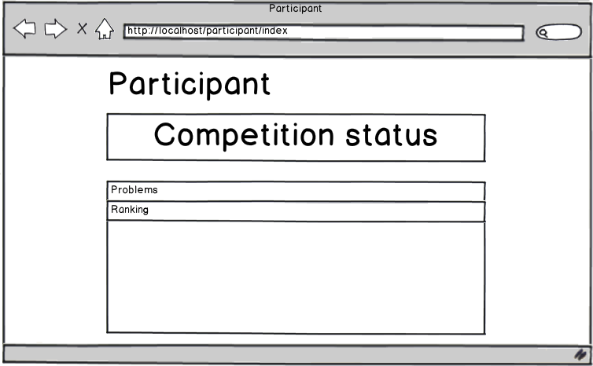

========
Features
========

-------------------
General Information
-------------------

More than one contest can be running at the same time (distinguished by their
IDs).

When a user logs in to the system, he directly is directed to his index
according to his role.

-----------
Participant
-----------

^^^^^^^^^^^^^^^^^^
Competition status
^^^^^^^^^^^^^^^^^^

.. image:: ../mockups/competition_information.png

The participant can see the following competition information while in
progress:

    * Current status
    * Remaining time

^^^^^^^^^^^^^^^^^^^^^^^^^
Problem and Solution view
^^^^^^^^^^^^^^^^^^^^^^^^^

.. image:: ../mockups/participant_problems_section.png

The participant sees a list of problems related to the current competition, if
it is in progress.

The submission results, after sending the solution, are the following:
    * Correct submission.
    * Compilation error
    * Run-time error
    * Time-limit exceeded.
    * Wrong answer.
    * Invalid file-type

^^^^^^^^^^^^^^^^^^^^^^^^^
Pending Judge evaluations
^^^^^^^^^^^^^^^^^^^^^^^^^

Show the pending judge evaluations for the solution.

^^^^^^^
Ranking
^^^^^^^

.. image:: ../mockups/ranking.png

The participant is able to see the overall ranking/standings of all
participants and of himself highlighted.

-----
Judge
-----

^^^^^^^^^^^^^
Solution List
^^^^^^^^^^^^^

The judge is able to view a list of submitted solutions which are correct with
the corresponding problem. He is able to evaluate, or re-evaluate (if already
judged), the solution.

^^^^^^^^^^^^^^^^
Evaluation logic
^^^^^^^^^^^^^^^^

When the `Evaluate` link is clicked, a new dialog appears first presenting the
source code submitted by the participant, a widget to rate the code quality and
a comment box.
