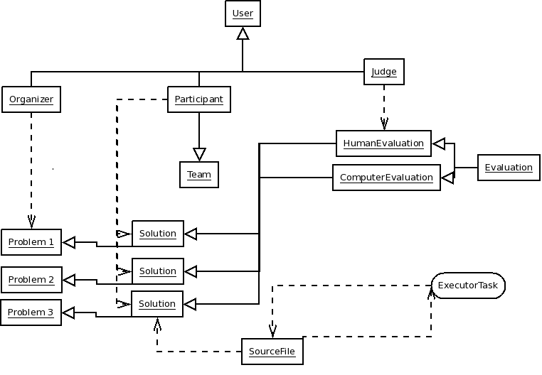

========
Overview
========

This document gives developers and users a short description of the application's architecture.

--------------------
High-level entities
--------------------

^^^^^^^^^^^
Competition
^^^^^^^^^^^

This is a basic diagram of a competition:

^^^^
User
^^^^

This object represents a (human) system user which has a public profile; used
for authentication and user profile.

^^^^^^^^^
Organizer
^^^^^^^^^

The organizer has multiple functions. To those we count:

  * Adding/removing/modifying ...

    * Participants
    * Teams
    * Human Judges
    * Problems

  * Starting/Stopping/Resetting the competition it is related to
  * Setting the duration of the competition
  * Blocking submission of participants

^^^^
Team
^^^^

A team is a set of participants with an unique label/name.

^^^^^^^^^^^
Participant
^^^^^^^^^^^

Obviously the most important of a competition. 

.. NOTE:: A competition needs at least two participants to be able to start.

The function of the participant is to submit solutions to each problem of the
competition's problem set.

Each participant must belong to one, and only one, team.

^^^^^
Judge
^^^^^

Represents human judge which creates an evaluation of each participant's
solution to a problem.

^^^^^^^
Problem
^^^^^^^

A problem is an object which is meant to be solved by a participant.

^^^^^^^^
Solution
^^^^^^^^

A solution is related to a problem, or better say, it provides the solution to a problem of the competition.

The solution contains a file; typically source code with a programming-language specific file extension. For example: ``main.py`` or ``Main.java``

Each solution weighs points. The amount of points are determined from the related Evaluation object.

^^^^^^^^^^
Evaluation
^^^^^^^^^^

The abstract object of HumanEvaluation and ComputerEvaluation.

Only one evaluation can be issued for each submitted solution by a Judge.

"""""""""""""""
HumanEvaluation
"""""""""""""""

The evaluation object which is provided by a HumanJudge object.

.. NOTE:: Only one HumanEvaluation can exist for one Solution.

""""""""""""""""""
ComputerEvaluation
""""""""""""""""""

The evaluation object which is provided by the computer.

.. NOTE:: Only one HumanEvaluation can exist for one Solution.

--------
Compiler
--------

